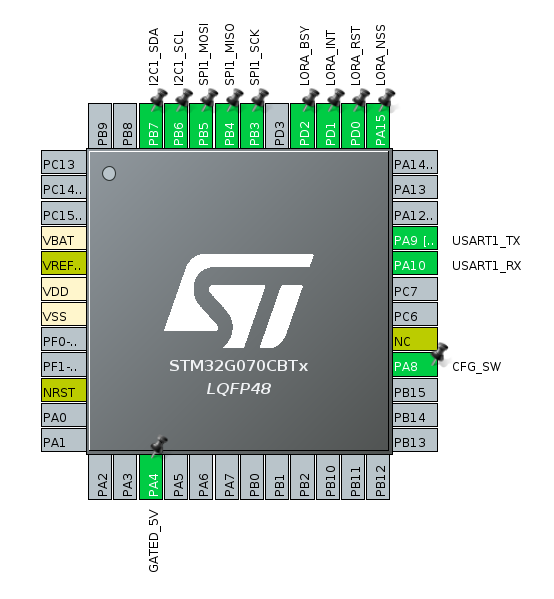

# STM32G070-Based LoRa Link Validation Test Bench

This repository contains the firmware and documentation for an embedded **LoRa Link Validation Test Bench** driven by an STM32G070CBTx MCU and Semtech SX1262 transceiver. The system operates as an asynchronous, event-driven node cluster designed to measure, stress-test, and log real-time RF telemetry (RSSI, SNR, packet loss) across point-to-point wireless topologies.

## System Capabilities
- **Deterministic Link Profiling**: Automated 100-packet stress testing sequences triggered via hardware user interface.
- **Asynchronous Telemetry Engine**: Event-driven architecture executing zero-block processing loops via a FreeRTOS real-time kernel.
- **Asynchronous Telemetry Diagnostics**: Direct message queue updates to a diagnostic character interface without impacting high-priority RF timing constraints.
- **Plug-and-Play LCD Hardware Layer**: Hot-swappable support for multiple display variants using runtime I2C bus profiling.

## Test Bench Milestones & Tracking

Detailed tracking of the validation setup can be found in the [Closed Issues](https://github.com/sumitadep002/STM32G070CBTX_FreeRTOS/issues?q=is%3Aissue%20state%3Aclosed) section.

| Issue ID | Description |
| :--- | :--- |
| **#23** | Integrate Dual LCD Panel Abstraction into Unified Board Driver |
| **#21** | Validate LoRa Transceiver TX/RX Ping-Pong Protocol Link |
| **#19** | Integrate Native LoRa Transceiver Peripheral Driver Code |
| **#17** | Bring up High-Speed SPI Master Interface for Radio Control |
| **#16** | Explore Basics of LoRa Physical Layer Configuration |
| **#13** | Implement Asynchronous FreeRTOS-based LCD Management Engine |
| **#12** | Handle User Input Debouncing via External Interrupt Service Routine |
| **#9** | Bring up 16x2 I2C LCD Diagnostic Panel |
| **#8** | Bring up I2C Serial Bus Communication Interface |
| **#6** | Process User Configuration Mode Shifts |
| **#5** | Add GPIO External Hardware Interrupt (EXTI) Layer |
| **#3** | Boot FreeRTOS Real-Time Scheduler on Target MCU |
| **#1** | Implement RTOS-Safe Thread Logging Port |

---

## FreeRTOS Implementation
The application relies on a preemptive FreeRTOS multitasking design optimized to keep the RF transceiver operating with minimal latency:

- **Producer-Consumer Thread Topology**: High-priority interrupt handlers act as event producers, capturing time-sensitive radio states and immediate user inputs. These events are dispatched via non-blocking queues to lower-priority processing tasks.
- **Thread-Isolated Logging Interface**: Implemented an interrupt-safe, thread-isolated logging subsystem (`#1`). This design eliminates the risk of resource contention and deadlocks when high-priority state transitions print diagnostic output simultaneously over the serial console.
- **Task Resource Sandboxing**: Allocated explicit stack allocations (`256 * 4` bytes) and priority configurations across isolated thread blocks to enforce runtime safety on memory-constrained Cortex-M0+ silicon.

## LoRa Integration & Optimization
The Semtech SX1262 library interface has been customized to handle deterministic point-to-point ping-pong cycles under heavy packet stress:

- **Asynchronous Radio Synchronization**: Bypassed inefficient polling loops by hardware-wiring the transceiver `BUSY` and `DIO1` pins straight to `osThreadFlags`. The application thread sleeps inside a low-overhead wait block until a fast hardware interrupt signals a packet completion event.
- **Atomic IRQ Clearing**: Rewrote the radio abstraction layer to execute selective interrupt management. By clearing specific active bits on the transceiver individually inside the GPIO EXTI context, the driver prevents edge-case state conflicts during rapid transmit-to-receive transitions.
- **Link Quality Telemetry Engine**: Integrated raw register-level hooks to pull instantaneous Received Signal Strength Indication (RSSI) and Signal-to-Noise Ratio (SNR) figures immediately after packet validation checks pass.

### LCD Real-Time Telemetry Interface
The local 16x2 panel functions as a high-density link diagnostic terminal, updating link health counters asynchronously:

**Telemetry Layout:**
- **Line 1**: `R:<rx_count> T:<tx_count> <last_payload>`
  - `R`: Running counter of valid packets received.
  - `T`: Running counter of packets transmitted.
  - `last_payload`: Numeric index sequence identifier of the last successful RF exchange.
- **Line 2**: `RSSI:<value> S:<value>`
  - `RSSI`: Received Signal Strength Indicator in dBm.
  - `S`: Signal-to-Noise Ratio (SNR) in dB.

---

## Board Hardware Variant Support
The display subsystem incorporates a startup bus scanner to allow transparent deployment of different display modules without firmware re-compilation:

* **Native Register Mode (Address `0x3E`):** Detects the integrated **RG1602A-19-I2C** display controller. It uses efficient 8-bit block array streaming to optimize bus usage.
* **Backpack Expansion Mode (Address `0x27`):** Detects the **RG1602A-I2C(P) Ver1.3** interface module containing an integrated **PCF8574T** I/O expander bridge. It emulates a 4-bit parallel sequence by splitting data bytes into dual nibbles and bit-banging the Enable clock line. A hardware timer (**TIM1**, prescaled to 63) handles precise microsecond signal pacing.

---

## Hardware Interconnection & Pin Mapping

The physical testing nodes are mapped deterministically using the following microarchitecture layout configured on the **STM32G070CBTx LQFP48** hardware package:

## System Directory Mapping

* `project/`: Main STM32CubeIDE workspace directory.
* `Core/`: Core device initializations (`main.c` incorporating advanced **TIM1** configuration) and master test-bench sequencing.
* `lora/`: Low-level Semtech SX126x driver abstraction and interrupt-isolated HAL.
* `lcd/`: Asynchronous, runtime-adaptive I2C LCD driver and display manager consumer task.
* `cfg_btn/`: Non-blocking, interrupt-driven button handler with duration checking.

* `lcd_sim.py`: Local terminal emulation platform.

## Test Bench Hardware Architecture

* **Target MCU Module**: STM32G070CBTX (LQFP48)
* **Dedicated Timebase**: Hardware Timer **TIM1** (Configured for 1$\mu$s clock counts to anchor sub-millisecond execution loops)
* **RF Transceiver Module**: Semtech SX1262 (via SPI Bus Master Interface)
* **Supported Display Elements**:
* Variant A: Native $I^2C$ Character LCD (**RG1602A-19-I2C** at Address `0x3E`)
* Variant B: Bridged PCF8574T Backpack Character LCD (**RG1602A-I2C(P)** at Address `0x27`)

* **Control Interface**: Debounced physical push button routed to the Config Switch (`CFG_SW_Pin`)

## Operational Guide

1. **Configure Node Operations**: Define `LORA_BOARD_MODE` inside `lora.h` as either `LORA_MODE_TX` (Transmitter Unit) or `LORA_MODE_RX` (Receiver Unit).
2. **Boot Monitoring Receiver**: Power up the RX node first. It will clear its status registers and enter an asynchronous listening mode.
3. **Boot Signal Transmitter**: Power up the TX node. The panel will display a `TX READY` state flag.
4. **Initiate Verification Cycle**: Depress and hold the User Button on the TX node for **1000ms**. The test bench will automatically begin a rapid, 100-packet link verification routine, updating telemetry data dynamically on both display panels.